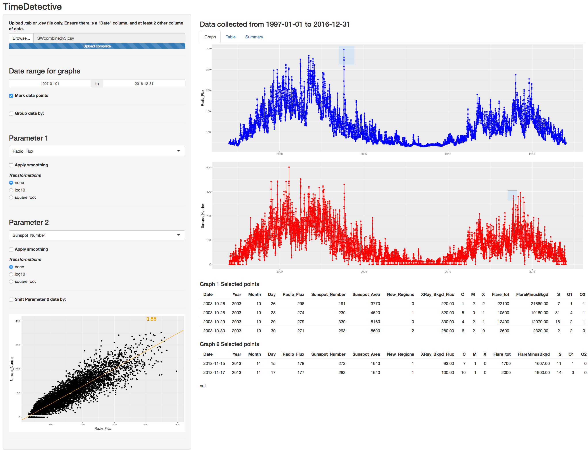

# TimeDetective #

TimeDetective is a web app written in [R](https://www.r-project.org/) that runs on [Shiny Server](https://shiny.rstudio.com/). The package contains two files:

1. `server.R`
2. `ui.R`
	
Required R libraries: shiny, ggplot2

The program had been tested on R version 3.4.3 and Shiny Server version v1.5.6.875.

## HOWTO ##
1. To use this package, first ensure Shiny Server is installed [according to the manual](https://shiny.rstudio.com/products/shiny/download-server/), running and that port `3838` is open (default port).

2. Clone or download this directory into the `/srv/shiny-server/` directory (or wherever the shiny app directories are stored on your server).

3. Open a web browser and go to the following url to start a session:
		`http:/localhost:3838/TimeDetective`

4. TimeDetective takes in only one text file that has either tab separated or comma separated columns. If the file does not have the standard suffix in the filename (i.e. `.tab` or `.csv`), the app can still be forced to read the file (select "all files" in the "file type" option during upload). 

5. The file must have headers with at least two columns; one called "Date" and the other a type of record. It is preferable to have the "Date" in the "YYYY-MM-DD" to reduce ambiguity. If there is hourly information available, a separate column is needed either called "Hour" for integers (0 - 23) or "Time" for HH:mm:ss format (00:00:00 - 23:59:59).

6. The rest of the app's use is quite self explanatory in the interface. Go ahead and try out the options! The following are things you should note:
	+ Uploaded data are not stored permanently and will be wiped from memory when the session ends.
	+ The first loading of the graphs will usually take data from the second and third column in your file.
	+ Drag selection of points in the main graph results in table outputs at the bottom of the main panel.
	+ The figure near the linear regression line in the scatter plot graph is the adjusted r-squared value.
	+ The "shifts" for `Parameter 2` currently only works for months, and data has to have complete months in order to work properly. Improvements are still in progress, with the addition of `Day` shift option.

## AUTHOR & COPYRIGHT ##
TimeDetective was developed by Joel Z.B. Low.

Copyright is under MIT license (see LICENSE.txt).
